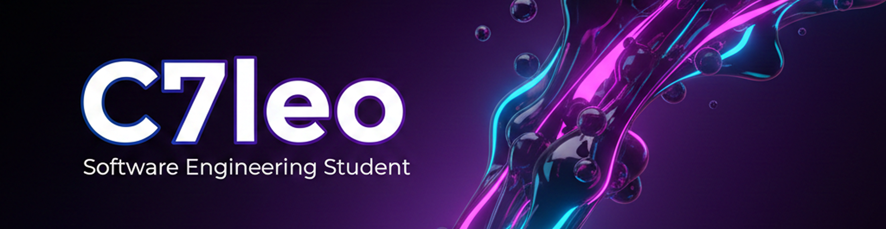

## About me

- I love crafting smooth, fast experiences with a playful touch.
- I prototype animated frontends and pair them with solid backends.

## Languages and tools

| Category | Icons |
| --- | --- |
| **Frontend** |  |
| **Backend** |  |
| **Database** |  |
| **DevOps / CI** |  |
| **Version control** |  |
| **IDEs / editors** |  |
| **Other tools** |  |
| **Operating systems** |  |

---

## Organizations

  
  
  
  
   

---

### Quick showreel

## Quick stats

## Contact

